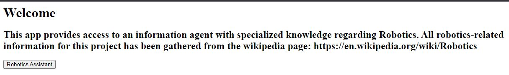
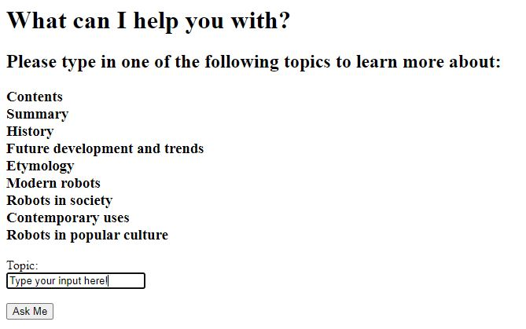
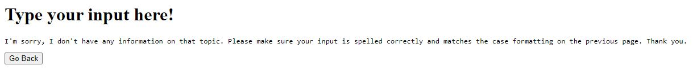
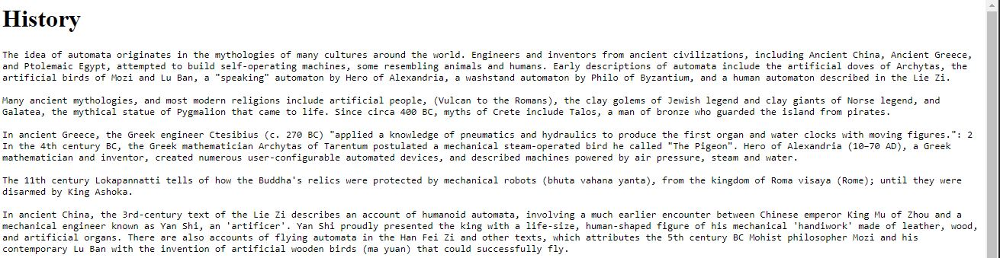
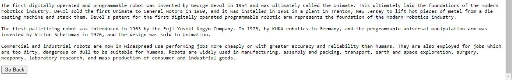

# Go Web App with Server-Side Rendering

## The Problem and Setup:
"...select an exemplary knowledge worker and build an information agent tailored to that knowledge worker's needs." -NU SPS

In this repository I have created a webapp with specialized knowledge. It acts as an information retreval agent where the user inputs a topic of interest and it produces information related to that topic. For this specific project, my selected knowledge worker is a Robotics Engineer and my information agent provides information related to robotics.

### The Data
The informational data for this project was scraped from the "Robotics" wikipedia page: https://en.wikipedia.org/wiki/Robotics

I have included the output.jsonl file that holds the scraped data in this repo, but go ahead and checkout https://github.com/MoriahI-NU/scraper where I go through the scraping process.

### The Model
My Go model utilizes the packages "html/template" and "net/http" to help facilitate website communication.

main.go holds code creating the different pages of the webapp. There is a homepage, from which the assistant/agent can be accessed. There is also an "ask" page which gives the option to receive user inputs. Lastly there is an "askSubmit" page which holds the information related to the user input. This is achievable by importing "webapp/assist", which holds a file I created that that contains the response logic of the information agent.

I coded the information agent in a separate file ("assist/assistlogic.go") to make everything organized and readable. In this file you'll find functions for reading and gathering the data which constitutes the agent's knowledge base. The file also includes a function dictating how the agent responds based on user input.

## Webapp Use and Preview:

1. Upon opening the webapp on localhost, you will be greeted with a homepage. Click the "Robotics Assistant" button to access the information agent.

The homepage provides a disclaimer revealing the information source. For future work, additional assistants could be created and accessed on the homepage with their own buttons.

2. The next page provides a list of topics with a box for user input. The user is meant to type in one of the options provided (with matching case format and correct spelling) and click the "Ask Me" button.

Should the user submit an input that is misspelled or not capitalized correctly, the app will take to to this page - from which you can return to the previous page and try another input.

3. With a proper input, the app will take you to the corresponding page that holds any related information. If you scroll down to the bottom of the informational page, there is a button that allows you to go back and inquire about another topic.

